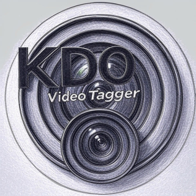

# Video Metadata Tagger



This Python script processes videos in a specified directory, extracts metadata (resolution, length, camera type, creation date, and object detection tags), and saves the results to a CSV file. It uses YOLOv8 for object detection and FFmpeg for camera type extraction, optimized for drone footage (e.g., DJI videos) but works with any MP4 files.

## Features
- **Metadata Extraction**:
  - **Resolution**: Video width x height (e.g., 3840x2160).
  - **Length**: Duration in seconds.
  - **Camera Type**: Parsed from FFmpeg’s encoder field or filename (e.g., "DJI Avata").
  - **Date Created**: From filename (e.g., `DJI_20240802161422_0005_D.MP4`) or file creation time.
  - **Tags**: Objects detected by YOLOv8 (e.g., "person", "car").
- **Efficient Processing**: Samples frames every 10 seconds to handle high-resolution (e.g., 4K) videos quickly.
- **Dynamic Output**: CSV filename is generated from the input path (e.g., `/path/to/videos` → `path-to-videos.csv`).

## Prerequisites
- **Python**: Version 3.8 or higher (3.13 recommended).
- **FFmpeg**: For camera type extraction.
- **Operating System**: Tested on macOS; should work on Linux/Windows with minor adjustments.
- **Hardware**: CPU sufficient; GPU (e.g., M1/M2 Mac) improves performance.

## Installation
1. **Install FFmpeg**:
   - On macOS:
     ```bash
     brew install ffmpeg
     ```
   - On Linux: `sudo apt-get install ffmpeg` (Ubuntu) or equivalent.
   - On Windows: Download from [FFmpeg website](https://ffmpeg.org/download.html) and add to PATH.

2. **Install Python Dependencies**:
   - Use `pipx` to isolate dependencies (recommended) or a virtual environment.
   - With `pipx`:
     ```bash
     pip install --user pipx
     pipx install ultralytics
     pipx inject ultralytics supervision opencv-python ffmpeg-python
     ```
   - With a virtual environment:
     ```bash
     python3 -m venv venv
     source venv/bin/activate
     pip install ultralytics supervision opencv-python ffmpeg-python
     ```

3. **Clone the Repository**:
   ```bash
   git clone https://github.com/omrik/kdo-video.git
   cd kdo-video
   ```

## Usage
1. **Prepare Videos**:
   - Place MP4 videos in a folder (e.g., `/path/to/videos`).
   - The script is optimized for DJI drone videos (e.g., `DJI_20240802161422_0005_D.MP4`) but works with any MP4.

2. **Run the Script**:
   - Specify the video folder as a command-line argument.
   - With `pipx`:
     ```bash
     ~/.local/pipx/venvs/ultralytics/bin/python scanvideo.py /path/to/your/videos
     ```
   - With virtual environment:
     ```bash
     source venv/bin/activate
     python scanvideo.py /path/to/your/videos
     ```

3. **Output**:
   - A CSV file (e.g., `path-to-your-videos.csv`) is created in the current directory.
   - Columns: `Video`, `Resolution`, `Length (s)`, `Camera Type`, `Date Created`, `Tags`.

### Usage Examples
#### Example 1: Process DJI Drone Videos
Run the script on a folder of DJI videos:
```bash
~/.local/pipx/venvs/ultralytics/bin/python scanvideo.py /path/to/drone_footage
```
**Output** (`path-to-drone_footage.csv`):
```
Video,Resolution,Length (s),Camera Type,Date Created,Tags
DJI_20240802161422_0005_D.MP4,3840x2160,60.00,Avata,2024-08-02 16:14:22,person,car
DJI_20240802161503_0006_D.MP4,3840x2160,45.50,Avata,2024-08-02 16:15:03,none
```

#### Example 2: Process Generic MP4 Videos
Run on a folder with non-DJI videos:
```bash
~/.local/pipx/venvs/ultralytics/bin/python scanvideo.py /path/to/home_videos
```
**Output** (`path-to-home_videos.csv`):
```
Video,Resolution,Length (s),Camera Type,Date Created,Tags
family_trip.mp4,1920x1080,120.25,Unknown,2024-07-01 10:30:00,person,dog
```

#### Example 3: Use a Different YOLO Model
Edit `scanvideo.py` to use `yolov8s.pt` for better accuracy:
```python
model = YOLO("yolov8s.pt")
```
Then run:
```bash
~/.local/pipx/venvs/ultralytics/bin/python scanvideo.py /path/to/drone_footage
```

## Customization
- **Sampling Rate**: Edit `sample_interval = 10` to change frame sampling (e.g., `5` for every 5 seconds).
- **Model**: Use `yolov8s.pt` or a drone-specific model (e.g., VisDrone-trained) for better accuracy:
  ```python
  model = YOLO("yolov8s.pt")
  ```
- **Output Path**: Save CSV elsewhere:
  ```python
  output_file = os.path.join("/desired/output/path", video_dir.replace("/", "-").strip("-") + ".csv")
  ```

## Troubleshooting
- **ModuleNotFoundError**:
  - Ensure all dependencies are injected (`pipx inject ultralytics supervision opencv-python ffmpeg-python`).
- **Empty CSV**:
  - Verify the video path exists and contains `.MP4` files.
  - Try `yolov8s.pt` for better object detection.
- **Camera Type "Unknown"**:
  - Run `ffprobe -v quiet -print_format json -show_streams /path/to/video.mp4` to check `codec_long_name`.
  - Adjust the script’s `camera_type` parsing if needed.
- **Slow Processing**:
  - Add frame resizing:
    ```python
    frame = cv2.resize(frame, (640, 640))
    ```
  - Use a GPU-enabled Mac (M1/M2) with `torch` MPS support.

## Contributing
Open issues or pull requests for improvements, such as:
- Support for other video formats.
- Enhanced metadata extraction.
- Custom YOLO models for specific drone types.

## License
MIT License. See [LICENSE](LICENSE) for details.

## Acknowledgments
- Built with [Ultralytics YOLOv8](https://github.com/ultralytics/ultralytics), [OpenCV](https://opencv.org/), and [ffmpeg-python](https://github.com/kkroening/ffmpeg-python).
- Optimized for DJI drone footage but adaptable to other video sources.
